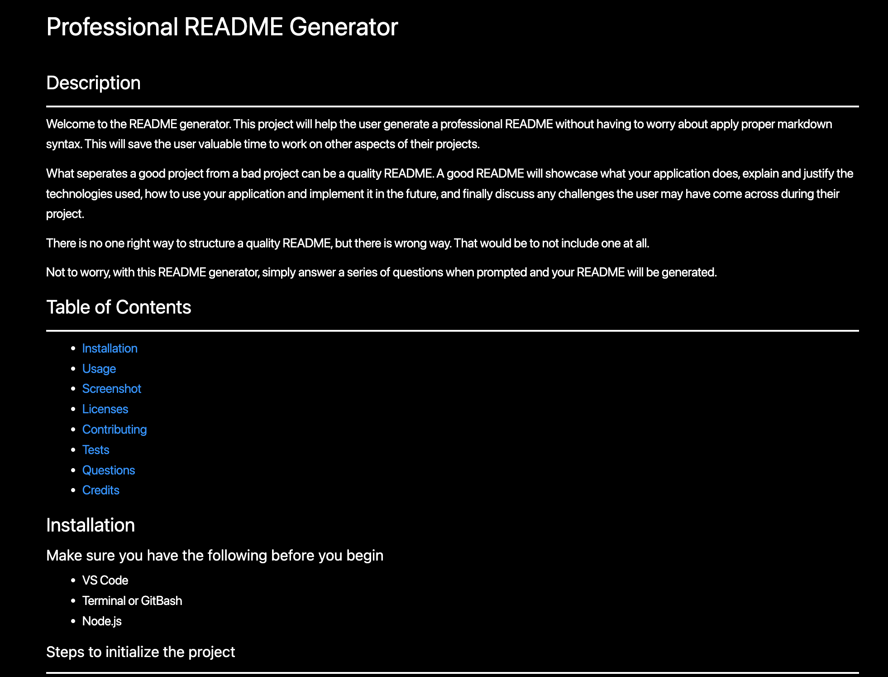

# Professional README Generator

## Description

___

Welcome to the README generator.  This project will help the user generate a professional README without having to worry about apply proper markdown syntax.  This will save the user valuable time to work on other aspects of their projects.

What seperates a good project from a bad project can be a quality README.  A good README will showcase what your application does, explain and justify the technologies used, how to use your application and implement it in the future,  and finally discuss any challenges the user may have come across during their project.

There is no one right way to structure a quality README, but there is wrong way.  That would be to not include one at all.

Not to worry, with this README generator, simply answer a series of questions when prompted and your README will be generated.

## Table of Contents

___

* [Installation](#installation)
* [Usage](#usage)
* [Screenshot](#screenshot)
* [Licenses](#licenses)
* [Contributing](#contributing)
* [Tests](#tests)
* [Questions](#questions)
* [Credits](#credits)

## Installation

### Make sure you have the following before you begin

* VS Code
* Terminal or GitBash
* Node.js

### Steps to initialize the project

___

1. **Copy Link:** Within this repository, hit the "Code" button to copy the link.
1. **Clone Code:** Using your terminal or Gitbash, type the following:  "git clone *paste copied URL here*"
1. **Install NPM:** Being in the correct directory of your project, install NPM using the command "npm init -y" in your command line on your terminal or Gitbash.
1. **Intall Inquire:** Being in the correct directory of your project, install inquirer using the command "npm install inquirer@8.2.4" in your command line on your terminal or Gitbash.
1. **RUN the APP:** You are ready to run the application.

## Usage

___
Once your software is downloaded and the Node packages are initialized it is time to begin.

In the correct directory, open up the terminal and use the command "node index.js".

You will be prompted with all the important questions that will autogenerate your README.

Your README will be generated and placed in the "dist" folder.

If you are unsure what to include in your read me, please click on the link below.

[How to create a Professional README](https://coding-boot-camp.github.io/full-stack/github/professional-readme-guide)

## Screenshot

## Demonstration
<!-- TODO: add demo video -->
___
Click [Here]() to see a guided video of the README Generator being used.

## Licenses

___

N/A

## Contributing

___
If you are interested in contributing to this or other projects in this repository, please reach out.

## Tests

___
To test this app, open up the file in VS Code. Open the terminal, make sure you are in the proper directory, and run *node index.js*. Answer the prompts and view the preview of the **generated-README.md** file in the "dist" folder.

## Questions

___
Do you have questions about this project?  Please feel free to reach out to me.

| GitHub Username                    | Email          |
| --------                           | -------------- |
| https://github.com/TyGosley | tygosley@gmail.com  |

## Credits

___

[Markdown Crash Course](https://www.youtube.com/watch?v=HUBNt18RFbo)

[Starter Code](https://github.com/coding-boot-camp/potential-enigma)

[NPM Install](https://docs.npmjs.com/cli/v6/commands/npm-init)

[NPM Inquirer](https://www.npmjs.com/package/inquirer)

[Codecademy](https://www.codecademy.com/learn)

[Khan Academy](https://www.khanacademy.org/)

[MDN Docs](https://developer.mozilla.org/en-US/)

[W3Schools](https://www.w3schools.com/js/default.asp)

[JavaScript.info](https://javascript.info/)

[CodeHS](https://codehs.com/)
